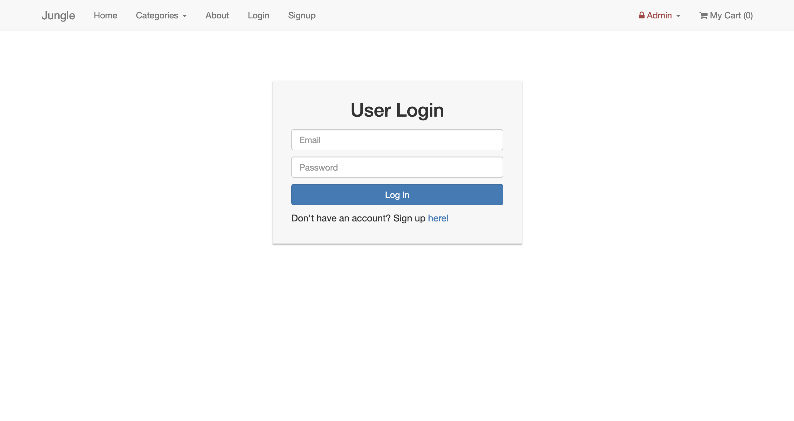
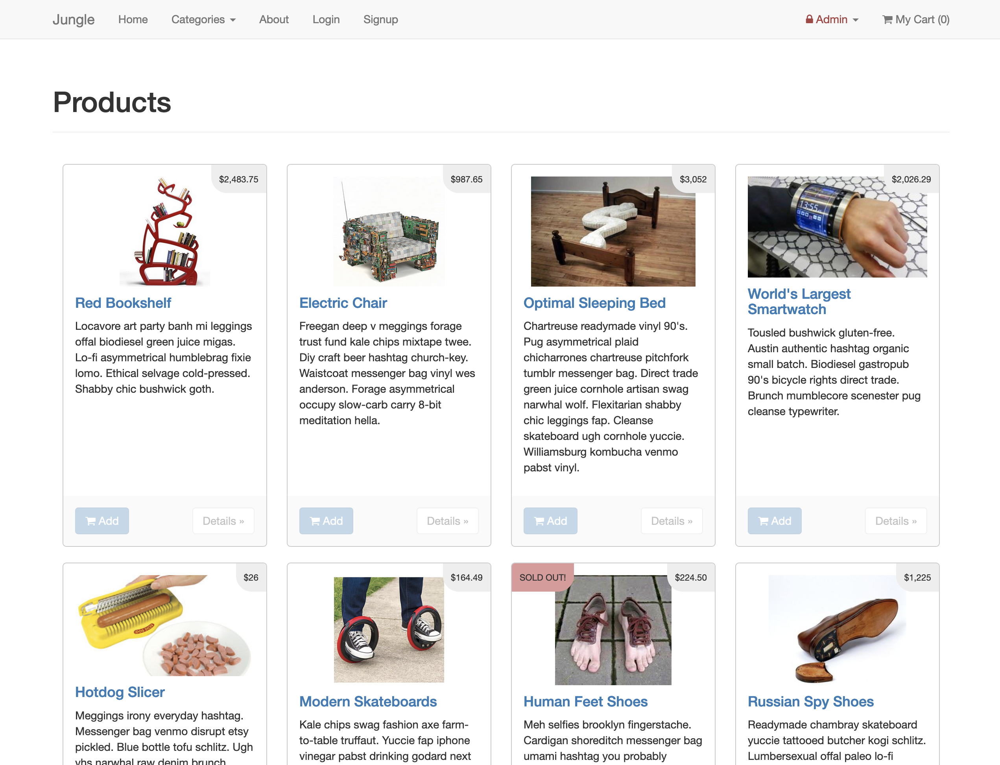
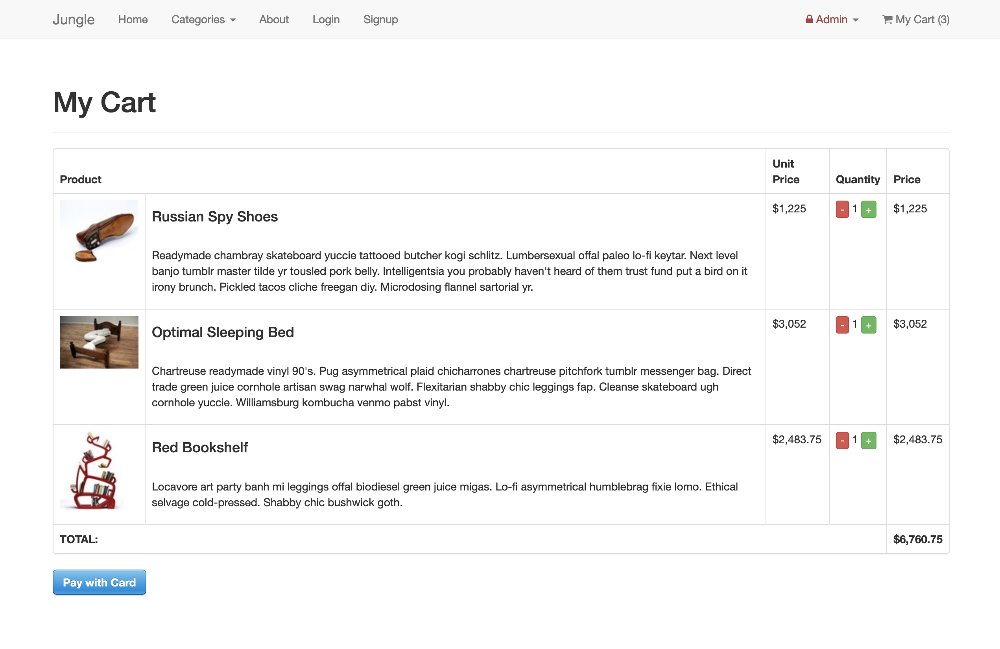
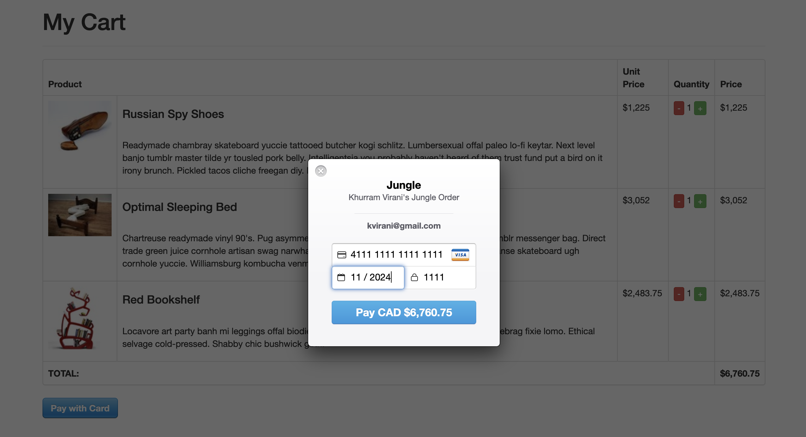
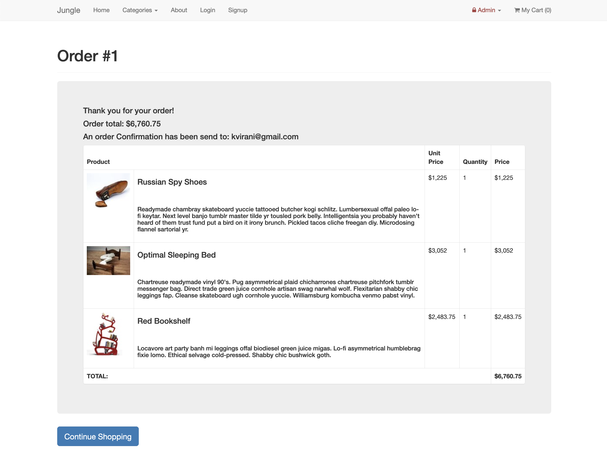
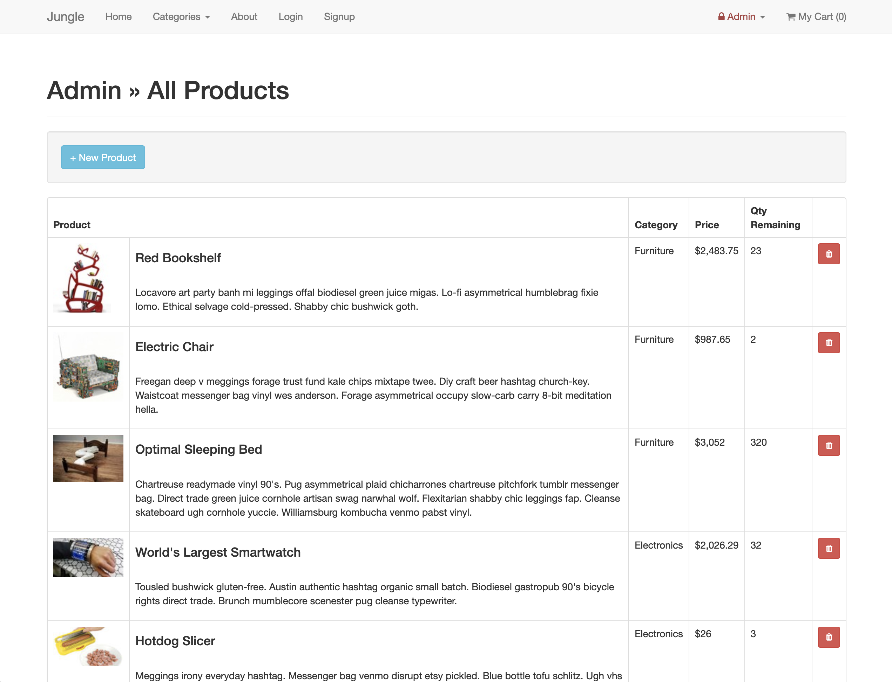
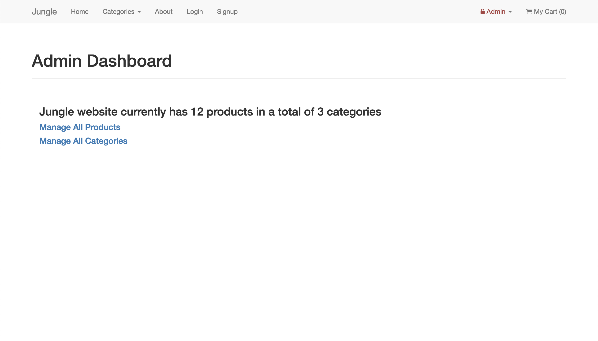
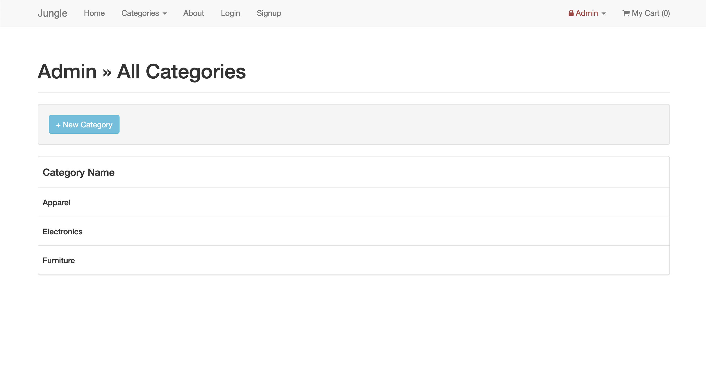

<h1 align="center">Jungle</h1>

## Table Of Contents

- [Summary](#summary)
- [Features](#features)
  - [Admin Controls](#admin-controls)
  - [Users](#users)
  - [Products](#products)
  - [Cart & Checkout](#cart--checkout)
  - [Other](#other)
- [Testing](#testing)
  - [RSpec Testing](#rspec-testing)
  - [Capybara Testing](#capybara-testing)
- [Screenshots](#screenshots)
- [Getting Started](#getting-started)
  - [Additional Steps for Apple M1 Machines](#additional-steps-for-apple-m1-machines)
  - [Setup](#setup)
  - [Stripe Testing](#stripe-testing)
  - [Dependencies](#dependencies)
- [Purpose](#purpose)

# Summary
A mini e-commerce application built with **Rails 4.2** as part of the **Lighthouse Labs' Web Development Bootcamp** curiculum for the purposes of teaching [Rails](http://guides.rubyonrails.org/v4.2/) along with [RSpec](https://github.com/rspec/rspec-rails) and [Capybara](https://github.com/teamcapybara/capybara) testing. 

The Jungle project simulates the real-world scenario of inheriting a project containing older frameworks and/or dependencies. This project emphasizes the need for strong problem solving skills to find solutions applicable to this specific/older version of a codebase in order to avoid breaking functionality while implementing new features or modifications.

The tasks for this project involved integrating new features such as user authentication, category creation, a "sold out" badge, an order detail page, an admin dashboard, and multiple bug fixes from the original repository. Tests were also added to both the existing and new features.

## Features
- ### Admin Controls:
  - Create products with titles, images, descriptions, price etc.
  - Delete Products
  - Create categories and browse all existing categories for products
  - Dashboard page summary of all products and categories
- ### Users:
  - Setup User Authentication ([Using 'bcrypt' and 'has_secure_password'](https://gist.github.com/thebucknerlife/10090014))
  - Nav Bar
    - 'Singup' button
    - 'Login' button
    - Label for currently logged-in user
- ### Products:
  - View a list of all current existing products
  - Mark with visual cue if product is out of stock
  - Add items to a cart if in stock
- ### Cart & Checkout:
  - Implemented a different layout when attempting to view an empty cart
  - Created an order confirmation page
- ### Other:
  - Added an "About" page
## Testing
- ### RSpec Testing
  1. Tested validation of all user registration fields
  2. Ensured all failing tests returned a valid error message

- ### Capybara Testing
  1. Home Page - Check if products load on home page
  2. Product Details - Check if clicking on a product loads the product details page
  3. Add to Cart - Check if adding an item to cart updates the "My Cart" total in the Nav bar

## Screenshots
### User Login Page

### Home Page

### Cart Page

### Stripe Checkout

### Order Confirmation

### Admin - All Products Page

### Admin Dashboard Page

### Admin Categories Page

## Getting Started
### Additional Steps for Apple M1 Machines

1. Make sure that you are runnning Ruby 2.6.6 (`ruby -v`)
1. Install ImageMagick `brew install imagemagick imagemagick@6 --build-from-source`
3. Remove Gemfile.lock
4. Replace Gemfile with version provided [here](https://gist.githubusercontent.com/FrancisBourgouin/831795ae12c4704687a0c2496d91a727/raw/ce8e2104f725f43e56650d404169c7b11c33a5c5/Gemfile)

### Setup

1. Run `bundle install` to install dependencies
2. Create `config/database.yml` by copying `config/database.example.yml`
3. Create `config/secrets.yml` by copying `config/secrets.example.yml`
4. Run `bin/rake db:reset` to create, load and seed db
5. Create .env file based on .env.example
6. Sign up for a Stripe account
7. Put Stripe (test) keys into appropriate .env vars
8. Run `bin/rails s -b 0.0.0.0` to start the server

### Stripe Testing

Use Credit Card # 4111 1111 1111 1111 for testing success scenarios.

More information in their docs: <https://stripe.com/docs/testing#cards>

### Dependencies

* Rails 4.2 [Rails Guide](http://guides.rubyonrails.org/v4.2/)
* PostgreSQL 9.x
* [Stripe](https://stripe.com/docs/api)
* [Rspec-Rails](https://github.com/rspec/rspec-rails)
* [Capybara](https://github.com/teamcapybara/capybara)
* [Poltergeist](https://github.com/teampoltergeist/poltergeist)
* [Database Cleaner](https://github.com/DatabaseCleaner/database_cleaner)

